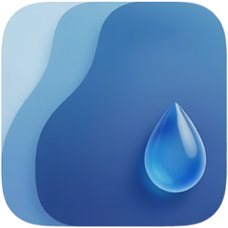

  
  <h1>LiquidBackdrop</h1>
  
  

    <strong>Liquid Glass Effect for the Web</strong>
  

  
  
  

---

## 🌊 Overview

**LiquidBackdrop** is a lightweight, dependency-free JavaScript library that replicates new "Liquid Glass" UI design found in latest OS made by Apple directly in the web browser.

Unlike standard CSS `backdrop-filter: blur()`, LiquidBackdrop generates **real-time SVG Displacement Maps** based on the element behind it. It simulates light refraction, dispersion (RGB split), and variable bevels.

---

## ⚠️ Browser Compatibility

**Current Status:** Chromium-exclusive.

The LiquidBackdrop library relies on advanced CSS-to-SVG bridging features that are currently only fully implemented in the Chromium rendering engine. Effect works by injecting a generated SVG Displacement Map (`<feDisplacementMap>`) into the CSS `backdrop-filter` property using a URL reference (e.g., `backdrop-filter: url(#liquid-map)`).

While `backdrop-filter` is widely supported:
1.  **WebKit (Safari / iOS):** Does not currently support referencing **SVG filters** within the `backdrop-filter` property. It ignores the custom filter entirely.
2.  **Gecko (Firefox):** Has limited support for SVG filters in this context and fails to render the displacement map correctly against the backdrop content.
